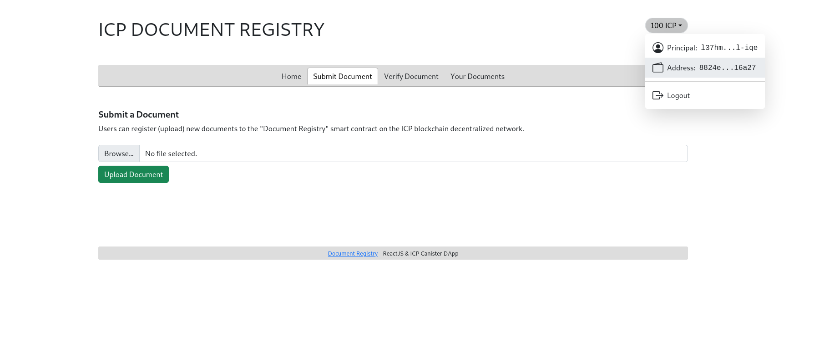

# ICP DOCUMENT-REGISTRY

This is a Dapp that helps users verify documents that have been issued by an organization. 

The application uses the encryption methods sha256 and keccak-256 to produce a distinct key that is identifiable to that single issued document.

## Contract Parameters

- Users have the ability to add documents to the contract and they can also delete the documents they added.
- To add a document, user has to pay a set fee of ICP in example the fee is set to 2 ICP tokens.
- To verify a document, user has to pay a fee of ICP in example the fee is set to 1 ICP token.

## Use Cases

1. This Dapp can be used by document issuing organizations, like schools, business, e.t.c.
2. It can be used to ensure validity of a particular document, and help reduce the effect of forgery in the professional world.

## How to deploy canisters

- Start the Local Internet Computer

    ```bash
    dfx start --background --clean
    ```

- Deploy the Ledger Canister

    ```bash
    npm run deploy:ledger
    ```

- Deploy the Internet Identity Canister

    ```bash
    npm run deploy:identity
    ```

- Deploy the Backend Canister

    ```bash
	# run with dfx and set addDocFee and verifyDocFee in e8s

	dfx deploy dfinity_js_backend --argument '(record {addDocFee = <amount in e8s>; verifyDocFee = <amount in e8s> })'

	# or run using npm with preset values
	# addDocFee = 2_0000_0000 i.e 2 ICP tokens
	# voteTime = 1_0000_0000 i.e 1 ICP tokens
	npm run deploy:backend

    ```

- Deploy the Frontend Canister

    ```bash
    npm run deploy:frontend
    ```

- Run Frontend Locally

    ```bash
    npm run start
    ```

## Minting Tokens to your account

This next step shows how to mint icp tokens from the locally deployed Ledger canister.

- Copy your dfx address from the wallet on the doc reg frontend by clicking on it.

    

- Run the mint script.

    ```bash
    # npm run mint:tokens <amount in e8s> <dfx address>
   npm run mint:tokens 500_0000_0000 aa3d50ea7b070d4349eda6ff4b0318c4f896ff4b0318c4f89

	# N/B: This mints 500 ICP tokens from the locally deployed ledger to the address.
    ```
